# 🚀 Push Sync Template

<div align="center">


[](https://github.com/patacoing/push-sync-template/releases)
[](https://github.com/patacoing/push-sync-template/stargazers)
[](https://github.com/patacoing/push-sync-template/issues)
[](https://github.com/patacoing/push-sync-template/blob/main/LICENSE)
[](https://github.com/marketplace/actions/push-sync-template)

</div>

---

A **powerful GitHub Action** that automatically syncs updates from a template repository to all repositories that were created from it. Instead of requiring each repository to periodically pull changes, this action uses a **push model** where updates are proactively distributed to all child repositories.

> 💡 **Smart Template Synchronization**: Keep all your repositories in sync with your template changes automatically!

## ✨ What it does

<table>
<tr>
<td width="50%">

### 🔍 **Discovery Phase**
- 📋 Finds all repositories in your organization
- 🎯 Identifies repos created from your template
- 🔄 Validates sync requirements

</td>
<td width="50%">

### ⚡ **Synchronization Phase** 
- 🌟 Creates dedicated sync branches
- 🔀 Merges template updates intelligently
- 📝 Opens pull requests automatically

</td>
</tr>
</table>

### 🎯 **Detailed Process**

```mermaid
graph LR
    A[Template Updated] --> B[🔍 Find Child Repos]
    B --> C[🌟 Create Sync Branch]
    C --> D[🔀 Merge Changes]
    D --> E[📝 Create PR]
    E --> F[👥 Assign Reviewers]
```



1. **🔍 Discovers child repositories** - Finds all repositories in your organization that were created from a specific template
2. **🌟 Creates sync branches** - For each child repository, creates a new branch with the latest template changes
3. **🔀 Merges template updates** - Applies template changes using `git merge --squash` with conflict resolution favoring template changes
4. **📝 Opens pull requests** - Automatically creates PRs in each child repository with the synced changes
5. **👥 Assigns reviewers** - Optionally assigns default reviewers and/or GitHub Copilot for review

## 🔄 Push Model vs Pull Model

<div>

| 🔴 **Pull Model**                    | 🟢 **Push Model** (This Action)        |
| ----------------------------------- | ------------------------------------- |
| Each repository checks periodically | Template pushes updates automatically |
| Inconsistent update timing          | Immediate distribution                |
| PAT management per repo             | Single PAT management                 |

</div>

## 📋 Configuration Inputs

<div>

### 🔧 **Required Parameters**


| Parameter                  | Description                     | Example                     |
| -------------------------- | ------------------------------- | --------------------------- |
| `organization`             | GitHub organization name        | `my-awesome-org`            |
| `template_repository_name` | Name of the template repository | `my-template-repo`          |
| `github_pat`               | GitHub Personal Access Token    | `${{ secrets.GITHUB_PAT }}` |

</div>

<div>

### ⚙️ **Optional Parameters**

</div>

<details>
<summary><strong>🎨 Customization Options</strong></summary>

| Parameter        | Description               | Default                                                                                       | Variables Available                                                           |
| ---------------- | ------------------------- | --------------------------------------------------------------------------------------------- | ----------------------------------------------------------------------------- |
| `commit_message` | Commit message for sync   | `chore(sync-template): synced ${template_repository_name} with latest changes`                | `${template_repository_name}`, `${branch_name}`, `${latest_template_commit}`  |
| `branch_name`    | Branch for sync operation | `syncing-template-until-${latest_template_commit}`                                            | `${template_repository_name}`, `${latest_template_commit}`                    |
| `pr_title`       | Pull request title        | `Sync template {template_repository_name}`                                                    | `${template_repository_name}`, `${branch_name}`                               |
| `pr_body`        | Pull request description  | `This PR syncs the template repository '{template_repository_name}' with the latest changes.` | `${template_repository_name}`, `${branche_name}`, `${latest_template_commit}` |

</details>

<details>
<summary><strong>👥 Review Options</strong></summary>

| Parameter                     | Description                                      | Default | Type      |
| ----------------------------- | ------------------------------------------------ | ------- | --------- |
| `default_reviewers`           | GitHub usernames for PR review (comma-separated) | -       | `string`  |
| `request_review_from_copilot` | Enable GitHub Copilot review                     | `false` | `boolean` |

</details>


## 🎨 Dynamic Content Interpolation

> 🔧 **Customize your sync experience** with dynamic variable substitution!

Personalize your commit messages, branch names, PR titles, and descriptions using these **interpolation variables**:

<div align="center">

| Variable                      | Description           | Example                |
| ----------------------------- | --------------------- | ---------------------- |
| `${template_repository_name}` | Template repo name    | `my-awesome-template`  |
| `${branch_name}`              | Generated branch name | `sync-template-abc123` |
| `${latest_template_commit}`   | Latest commit hash    | `abc123def456`         |

</div>

### 💡 **Example Customizations**

```yaml
# 🎯 Custom commit message
commit_message: "🚀 feat: sync ${template_repository_name} (${latest_template_commit})"

# 🌿 Custom branch naming
branch_name: "template-sync/${template_repository_name}/${latest_template_commit}"

# 📝 Custom PR title
pr_title: "🔄 Template Sync: ${template_repository_name} Updates"

# 📄 Custom PR body
pr_body: |
  ## 🚀 Template Synchronization
  
  This PR automatically syncs updates from **${template_repository_name}**.
  
  ### 📊 Details
  - **Branch**: `${branch_name}`
  - **Latest Commit**: `${latest_template_commit}`
  - **Sync Date**: $(date)
  
  Please review and merge when ready! 🎉
```

## 🛠️ Usage Examples

### 🚀 **Basic Setup**

<details>
<summary><strong>💡 Click to expand basic configuration</strong></summary>

```yaml
name: 🔄 Sync Template
on:
  push:
    branches: main

jobs:
  sync:
    runs-on: ubuntu-latest
    name: Template Synchronization
    steps:
      - name: Checkout repository
        uses: actions/checkout@v4
      
      - name: Sync template to child repositories
        uses: patacoing/push-sync-template@vmain
        with:
          organization: "my-org"
          template_repository_name: "my-template"
          github_pat: ${{ secrets.GITHUB_PAT }}
```

</details>

### ⚙️ **Advanced Configuration**

<details>
<summary><strong>🎨 Click to expand advanced setup with customizations</strong></summary>

```yaml
name: 🔄 Advanced Template Sync
on:
  push:
    branches: main

jobs:
  sync:
    runs-on: ubuntu-latest
    name: Advanced Template Synchronization
    steps:
      - name: Checkout repository
        uses: actions/checkout@v4
        with:
          fetch-depth: 0
      
      - name: Sync template with custom settings
        uses: patacoing/push-sync-template@vmain
        with:
          organization: "my-awesome-org"
          template_repository_name: "my-premium-template"
          commit_message: "🚀 chore(template): sync ${template_repository_name} → ${latest_template_commit}"
          branch_name: "template-sync/${latest_template_commit}"
          pr_title: "🔄 Template Update: ${template_repository_name}"
          pr_body: |
            ## 🚀 Automated Template Sync
            
            This PR contains the latest updates from **${template_repository_name}**.
            
            ### 📊 Sync Details
            - **Template**: ${template_repository_name}
            - **Branch**: ${branch_name}
            - **Commit**: ${latest_template_commit}
            - **Date**: $(date +'%Y-%m-%d %H:%M:%S')
            
            ### ✅ What's Changed
            Please review the changes and merge when ready!
            
            ---
            🤖 *This PR was created automatically by push-sync-template*
          default_reviewers: "maintainer1,maintainer2,team-lead"
          request_review_from_copilot: true
          github_pat: ${{ secrets.GITHUB_PAT }}
```

</details>

### 🔐 **GitHub PAT Setup**

<div align="center">

[](https://docs.github.com/en/authentication/keeping-your-account-and-data-secure/creating-a-personal-access-token)

</div>

Your GitHub Personal Access Token needs these **scopes**:

- 🔓 `repo` - Access to repositories
- 🔄 `workflow` - Workflow management  
- 🏢 `admin:org` - Organization access

> ⚠️ **Security Note**: Store your PAT in GitHub Secrets as `GITHUB_PAT`

## 🚧 Current Limitations & Roadmap

<div align="center">


</div>

### 🔄 **Coming Soon**

<table>
<tr>
<td width="100%">

#### 🎯 **Planned Features**
- [ ] 📁 Template sync ignore files (`.templatesyncignore`)
- [ ] 🏷️ Automatic PR labeling system

</td>
</tr>
</table>

### 📝 **Current Constraints**

> ⚠️ **Important**: Template and child repositories must be in the same organization

---

<div align="center">

### 🌟 **Star this project if you find it useful!**

[](https://github.com/patacoing/push-sync-template/stargazers)

</div>